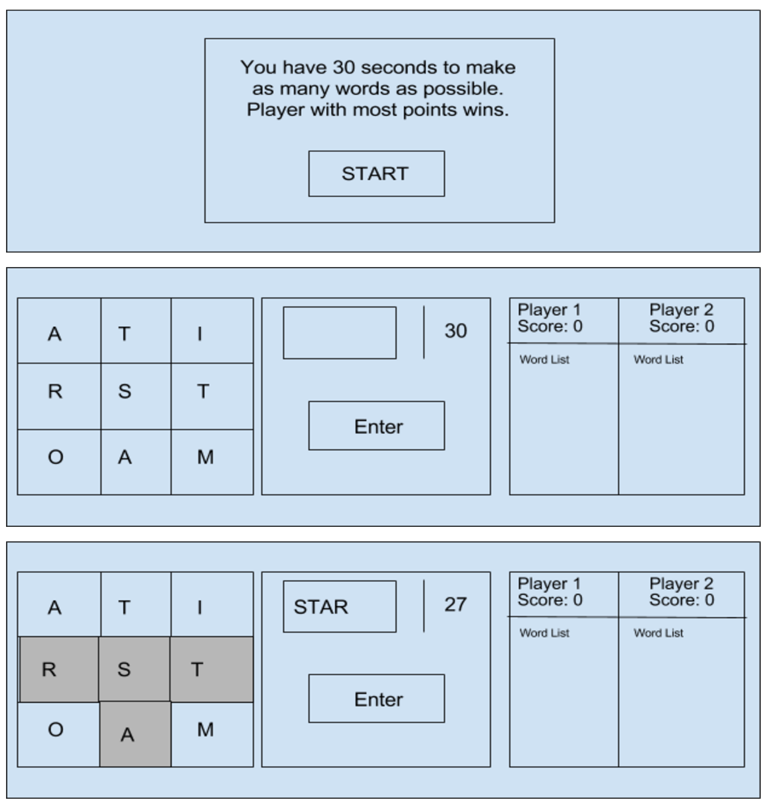
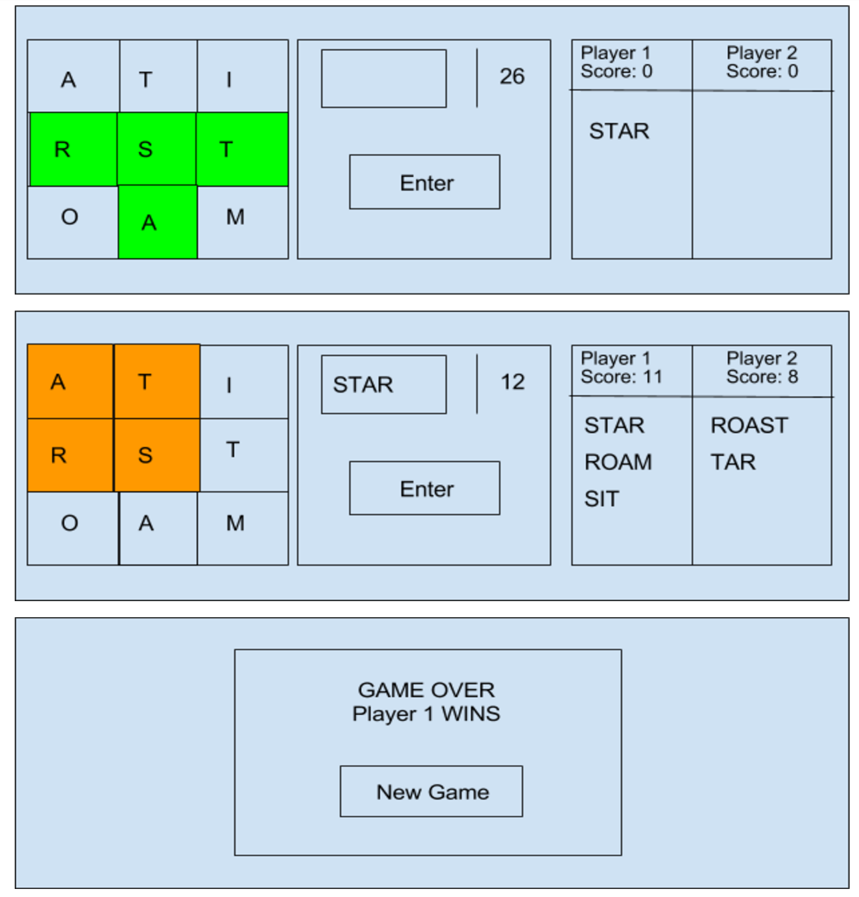

#Boggle

<https://justinhessdev.github.io/project01/>

###User Stories

Intro Screen - Create the intro screen with game directions. On click start the game and reveal the game screen

Game Screen - Split into three sections:

		Tiles - Contains 9 clickable tiles (3X3)

		Submit - Contains the countdown timer, area where clicked letters are displayed, and the enter button

		Score - Contains the score and word list of both players

Tiles Logic - When tile is clicked it turns gray. On enter, if it is a successful word, tiles turn green. If the word has already been used it turns yellow. If the word is not valid it turns red.

Word Logic - On successful word submission, add word to the player’s word list. Update the player’s score accordingly.

Turn Logic - When countdown timer reaches 0, the turn is complete. Player two begins his turn

Game Over Logic - When both players have completed their turns the game is over. Player with most points wins. Option to start a new game.

New Game Logic - The game is restarted. All elements are restored to default value.

ToDo:
1. Add better dictionary
2. Use more graphics and animations
3. Use input field to select tiles
4. Make new words appear at top of word list

###WireFrames

